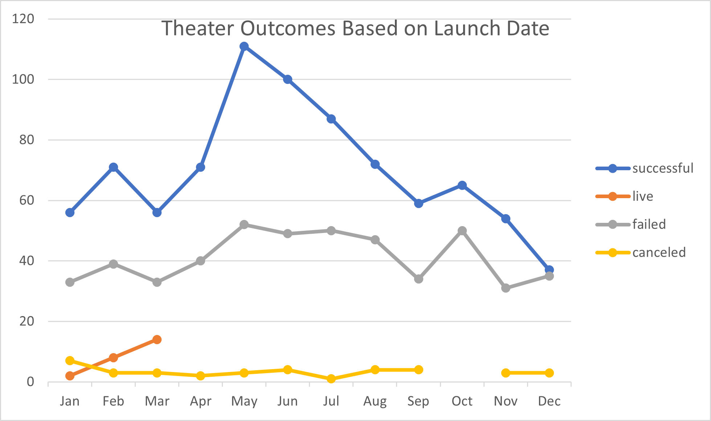
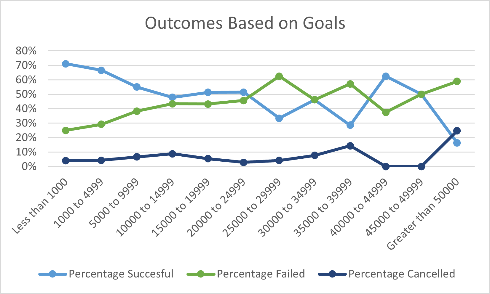

# Kickstarter-Challenge

## Background
  A  challenge given to me to analyze Kickstarter data on what makes a successful crowdfunding campaign. Analyzed the data set based on outcomes from multiple other aspects; including aspects such as parent category, country, launch date, and funding goals to help determine correlations between these aspects and the ability for a campaign to be  succesful. The hope behind analyzing this data is to find the most succesful indicators of a successsful crowd funding campaign, and to possibly use those aspects in our own crowd funding campaigns.

## Analysis and Challenges

### Overview
  Using the raw data from Kickstarter I was able to analyze the data sets based on different fields and categories using pivot tables and charts based on the tables generated. All the charts analyzed how different aspects of a campaign would correlate with if a campaign was successful or failed. One such chart made can be seen below.

From this chart one could see that theater based crowd funding campaigns had the most succesful campaigns during the month of May with a steady decline to September. However, this chart also does not show the percentage of successful campaigns overall so one may not conclude that the month of May had the highest overall percentage of successful campaigns in the theater category. 
  
### Challenges
  While I did not have any specific challenges with the analysis of this data set I do believe there will be a few common pitfalls that many would run into. The primary one being converting UNIX time stamps into a usable form for the average human. This can be solved by using the formula of =(((X/60)/60)/24)+DATE(1970,1,1) in Excel, replacing X with the cell containing the UNIX time stamp, and making sure that your current column is in the correct date format for Excel to recognize it. 

## Results

### Outcomes of Theater Projects
  First off the result of theater based funding projects can be seen earlier but will be repeated here:

From the chart once again it is fairly obvious that we can see the most succesful crowd funding campaigns happen in May and fall off until September.  You can also see that the lowest months for succesful campaigns are from October to March generally. I believe this has to do with the fact that many people tend to save money on things to spend during the heavier holiday shopping season around November to January and then having to save after spending most of their money. The summer months starting in May is when many people have more expendable income to put into things such as crowd funding campaigns for theater productions.

### Outcomes Based on Funding Goals
  The result of analysis of campaigns based on funding goals can be found here:
 
 From this chart a few things can be gleamed. First the highest chance of being funded for a campaign is to have a funding goal under $10,000. If a campaign is over $25,000 then the campaign has more of a chance to fail except for an outlier in the $40,000 to $45,000 bracket. Generally it seems that lower funding goals are much more likely to be funded than higher end ones. This most likely has to do with the fewer amount of people needing to donate to a campaign were each one to donate a similar amount of money to each campaign.

### Limitations
  Obviously these aspects and data can only explain so much of the picture and a large amount of the onus of the success on a crowdfunding campaign comes from the individual campaigns product/service being offered and the quality of the campaign. Data such as this cannot show those primarily qualitative aspects of each individual crowd funding campaign. There are also issues with the dataset only being from a single crowd funding campaign, Kickstarter. If you wanted a more complete picture of crowdfunding as a whole you would need to include data from other crowdfunding sites such as Indigogo. This is to ensure that the general trends seen in this data set are not exclusive to the Kickstarter platform and actually generally seen in all crowdfunding sites. You could even compare the succesful campaigns on each platform as a separate line entity on a line chart.
